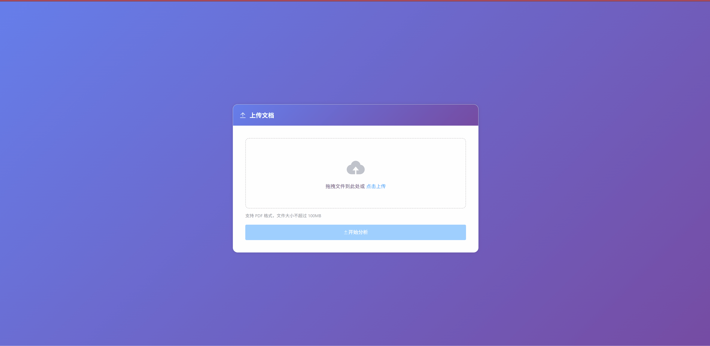

<div align="center">

# 🔍 CiteOrDie

### 证据驱动的 PDF 条款提取智能体（Agentic Document Intelligence）

**LangGraph 工作流编排 × MinerU 高精解析 × 长上下文 LLM**
把“条款结论”绑定到“可高亮的原文证据”，用于审阅、复核与交付。

[](https://opensource.org/licenses/MIT)
[](https://www.python.org/)
[](https://fastapi.tiangolo.com/)
[](https://vuejs.org/)
[](https://github.com/langchain-ai/langgraph)
[](https://github.com/opendatalab/MinerU)

**快速入口**：
[功能演示](#-功能演示) • [快速开始](#-快速开始) • [架构](#-架构与工作流) • [API](#-api-异步-jobs) • [输出格式](#-输出格式-schema) • [质量报告与评测](#-质量报告与评测) • [故障排查](#-故障排查) • [Issue](https://github.com/vanGodLEE/CiteOrDie/issues)

</div>

---

## 🧠 这是什么

**CiteOrDie** 是一个面向业务文档（招标、合同、政策、制度等）的 **PDF 条款提取智能体**。

它解决的不是“抽点文字”，而是：

✅ 抽取结构化条款（可检索/导出/对比/审核）

✅ 每条条款必带证据：可回指到 PDF 原文坐标（支持前端高亮 + 跳转）

✅ 平台化工程能力：Async Jobs + SSE 进度 + 幂等复用 + 质量报告 + 离线评测

> Principle: No citation, no conclusion.（没有证据，就没有结论）
---

## ✨ 你会得到什么

* **Agentic Workflow（LangGraph）**：把解析/抽取/定位拆成可插拔节点，支持并行与长流程
* **高精解析（MinerU）**：获取文本/表格/图片等内容块与 bbox，为证据定位打底
* **结构理解（PageIndex）**：抽取文档目录/章节层级，用于切分与并发
* **条款结构化**：输出条款的多维结构（type/actor/action/object/condition/deadline/metric…）
* **证据定位与高亮**：条款 → 原文证据块 → positions（坐标变换封装）→ 前端高亮联动
* **平台化工程**：

  * 异步 Jobs：创建/状态/进度/结果
  * 幂等复用：同一文档 + 同一 pipeline 配置命中历史产物，避免重复消耗
  * 质量报告：每次任务产出可观测指标与告警

---

## 📈 已有指标

* **100 页 PDF** 端到端平均耗时：**~7 分钟**
* **证据绑定率**（clauses_with_evidence / clauses_total）：**84.5%**
* **bbox 偏移率**（高亮偏移/越界/不一致类问题占比）：**~3%**


---

## 🏗️ 架构与工作流

### 工作流总览（LangGraph）

1. **TOC/结构抽取**（PageIndex + LLM）

   * 输出：章节树（title/depth/page_range）
2. **深度解析**（MinerU）

   * 输出：blocks/spans + bbox + page meta（含表格/图片/文本块）
3. **标题对齐 & 坐标封装**

   * 标题/章节节点 ↔ 原文块对齐
   * bbox → `positions`（统一坐标系、旋转/裁剪处理）
4. **条款抽取（Clause Mining）**

   * 输入：章节原文 + 上下文
   * 输出：结构化条款（含置信度/分类）
5. **证据定位（Evidence Locator）**

   * 条款 → 对应原文证据块（bbox/positions）
6. **结果落库 & 前端联动展示**

### 为什么要 PageIndex + MinerU

* **PageIndex**：擅长“结构”（章节/目录），用于切分并发与上下文组织
* **MinerU**：擅长“落点”（bbox/blocks），用于证据定位与高亮

> 备注：当前版本对 **文本型 PDF** 支持最好；扫描 PDF 的结构抽取可通过后续降级/替换策略增强。

---

## 🚀 快速开始

> 下面默认你仓库结构为 `backend/` + `frontend/`。如实际不同，把路径改成你的真实目录即可。

### 1) 克隆项目

```bash
git clone https://github.com/<YOUR_USERNAME>/CiteOrDie.git
cd CiteOrDie
```

### 2) 启动 MinIO（对象存储）

* 控制台：`http://localhost:9001`
* 默认账号：`minioadmin / minioadmin`
* 创建 bucket：如 `tender-pdf`（与 `.env` 一致）

（Windows/Linux 启动命令请见本文后续的 MinIO 章节或 `docs/minio.md`）

### 3) 后端（FastAPI）

```bash
# 创建 conda 环境（Python 3.10+）
conda create -n cite_or_die python=3.10 -y
conda activate cite_or_die

cd backend
pip install -r requirements.txt

cp .env.example .env
# 编辑 .env：配置 LLM / MinIO / 解析参数

uvicorn app.api.main:app --reload --port 8000
```

* API 文档：`http://localhost:8000/docs`

### 4) 前端（Vue3）

```bash
cd frontend
npm install
npm run dev
```

* 前端：`http://localhost:3000`

---

## 🔌 API（异步 Jobs）

> **推荐使用异步 Jobs**：大文档解析耗时长，Job 模式更稳定、易于扩展与平台接入。

| 接口                             | 方法        | 说明                                            |
| ------------------------------ | --------- | --------------------------------------------- |
| `/api/analyze`                 | POST      | 上传 PDF 并创建任务（返回 task_id / reused / cache_key） |
| `/api/tasks`                   | GET       | 任务列表                                          |
| `/api/task/{task_id}`          | GET       | 任务详情                                          |
| `/api/task/{task_id}`          | DELETE    | 删除任务                                          |
| `/api/task/{task_id}/progress` | GET (SSE) | 实时进度                                          |
| `/api/task/{task_id}/export`   | GET       | 导出 Excel                                      |

### 幂等复用（避免重复解析）

* 同一文档仅需上传一次即可留下任务轨迹
* 再次上传相同内容（且 pipeline 配置一致）会命中 **cache_key**，直接复用历史产物

返回示例：

```json
{ "task_id": "t_...", "reused": true, "cache_key": "sha256:...:v1:cfg..." }
```

---

## 📦 输出格式（Schema）

### 条款结构（示例）

```json
{
        "matrix_id": "0013-CLS-002",
        "node_id": "0013",
        "section_title": "Proposal Submission",
        "type": "obligation",
        "actor": "supplier",
        "action": "submit",
        "object": "Technical Proposal",
        "condition": "xxxxx",
        "deadline": "xxxxx",
        "metric": "xxxxx",
        "original_text": "(b) Technical Proposal: hqsact.techproposal@nato.int",
        "page_number": 5,
        "positions": [
            [
                4,
                93.636,
                534.6,
                380.664,
                548.856
            ]
        ]
}
```

> 完整字段说明请见：`docs/schema.md`

---

## 🧪 质量报告与评测

### Quality Report（每个任务都会产出）

覆盖：

* ingest：页数/旋转/裁剪框/扫描估计等
* toc：覆盖率/非法页段/层级深度/重叠与空洞
* parse：blocks 数量/空页/ocr 页/异常页
* alignment：对齐命中/未命中/bbox 越界
* clause/evidence：证据覆盖率/绑定率/偏移告警

示例入口：`/api/task/{task_id}` 返回 `quality_report` 字段

### Offline Evaluation（离线回归）

* Evidence Binding Rate（证据绑定率）
* BBox Drift Rate（偏移率；可选加 IoU）
* Latency p50/p95（耗时分位）

运行示例：

```bash
python -m eval.run --gold eval/gold.jsonl --pred outputs/clauses.json
```

---

## ⚙️ 配置

### `.env`（最小必填）

```bash
# LLM
LLM_API_KEY=...
LLM_API_BASE=...
EXTRACTOR_LLM_NAME=qwen-max-latest

# MinIO
MINIO_ENDPOINT=localhost:9000
MINIO_ACCESS_KEY=minioadmin
MINIO_SECRET_KEY=minioadmin
MINIO_BUCKET=tender-pdf
MINIO_SECURE=false
```

### 模型建议（长上下文优先）

* 中型文档：`qwen-max-latest (32K)`
* 大型文档：`qwen-long (1M)`
* 稳定通用：`gpt-4o (128K)`

---

## 📋 文档支持与限制

* ✅ 文本型 PDF（最佳）：可选中复制文字，PageIndex 结构识别更稳定
* ⚠️ 扫描/图片型 PDF：MinerU 可解析出 bbox，但结构抽取可能失败（可通过后续降级策略增强）

建议：

* 优先使用结构清晰的 PDF（标题层级明确）
* 大文档优先用长上下文模型

---

## 🧰 性能与并发

* 主要瓶颈：MinerU 解析（CPU/内存）与 LLM 调用（网络/限流）
* 当前支持：最多 **4 章节并发**（可配置）
* 单实例用户并发：**10–20**（取决于 CPU 核数、内存与 LLM 限速）

---

## 🧯 故障排查

### PageIndex 解析失败

* 多见于：扫描/图片型 PDF 或结构极不规范的文档
* 建议：

  1. 换文本型 PDF（或从源文档重新导出）
  2. 换更强的结构抽取模型（如长上下文）
  3. 使用降级策略（待补充：无 TOC 模式/段落聚类模式）

### MinIO 连接失败

* 检查健康：`curl http://localhost:9000/minio/health/live`
* 检查端口占用/环境变量配置

### LLM 调用失败

* 检查 `LLM_API_KEY` / `LLM_API_BASE`
* 注意供应商限流：可调并发、加重试与退避

---

## 🧑‍💻 贡献指南

欢迎 PR：

1. Fork
2. feature 分支
3. 提交 PR

建议提交前：

```bash
pytest
ruff check .
```

---

## 📄 许可证

MIT

---

## 🙏 致谢

* LangGraph / LangChain
* MinerU
* PageIndex
* FastAPI
* Vue3 + Element Plus

---

## 🎬 功能演示

### 上传


### 结果展示和交互


### 质量报告


---

⭐ 如果项目对你有帮助，欢迎 Star。
